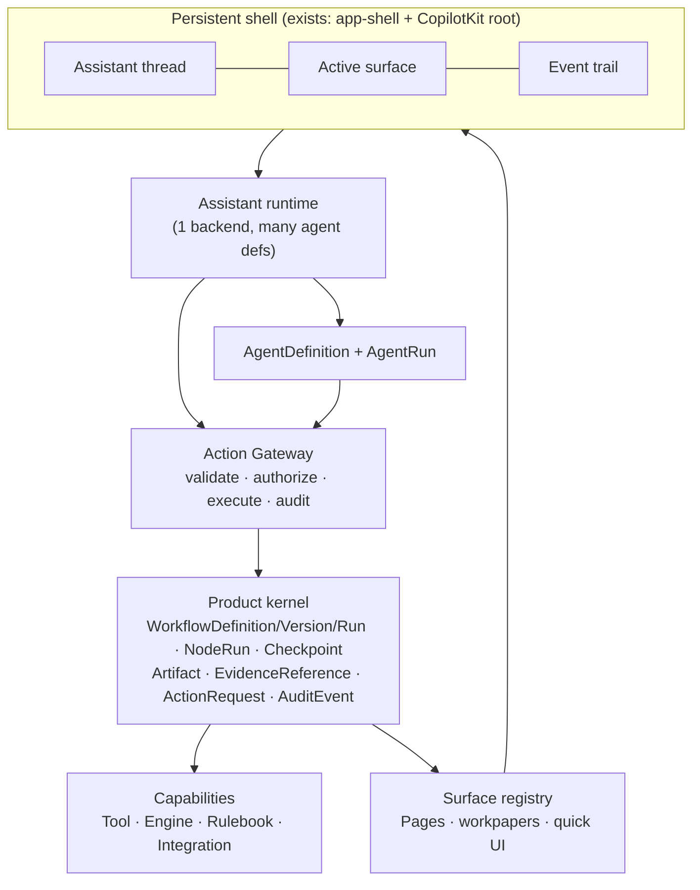

# TaxflowOS — Product Kernel: Target Architecture & Migration Specification

*Status: proposal / target design. Not the current state — the living `audit/` folder documents what exists today. This document is forward-looking.*
*Author: architecture pass. Grounded in a source-level audit of the repo (see §1).*

---

## 0. What this document is

The prototypes in this codebase are strong but were built independently, so the same concept (a "run", a "node", an "agent", an "execution log") exists three or four times in incompatible shapes. This is the direct cause of the 128 TypeScript errors and the "several powerful prototypes loosely connected" feeling.

This spec does **one thing**: it defines a single **product kernel** — a canonical set of types and one dispatch path — and maps every existing file/system onto it. It does **not** propose a rewrite. The strategy is *strangler-fig*: adapters wrap the existing code, the kernel becomes the single vocabulary, and the duplicates are collapsed one at a time.

Read it in this order: §1 (what exists, precisely) → §2 (the kernel types) → §3–§8 (each kernel subsystem + its migration) → §9 (the ordered plan) → Appendix A (the file-by-file fate table).

**Ground rules (unchanged from the architecture brief):**
- The chat is the operating layer, **not** the source of truth. The workflow runtime, artifacts, evidence and audit remain authoritative underneath it.
- Eight concepts stay separate and must share one vocabulary across builder, assistant, agents and backend: **Assistant, Agent, Workflow, Tool, Rulebook, Artifact, Surface, Event**.
- Preserve: the page↔chat contract, resource registry, React Flow builder, evidence/lineage, deterministic tools, guided checkpoints, constrained generated UI, encrypted credentials.
- Consolidate: the workflow runtimes, persona-only agents, client-side direct mutation, ephemeral UI, localStorage-as-truth, `new Function`, client-side copilot recovery.

---

## 1. Current state — what actually exists (source-verified)

### 1.1 Four workflow runtimes

| # | System | Key files | Executes how | Run/exec types | Persistence |
|---|--------|-----------|--------------|----------------|-------------|
| **A** | Template-run wizard (chat / `/run`) | `lib/workflow-runs/engine.ts`, `index.ts`, `fapi.ts` `roulement.ts` `expense.ts` `campaign.ts`; `components/workspace/workflow-run-flow.tsx`; `app/run/[workflowId]/page.tsx` | Fixed 4-stage reducer `source→classify→compute→decide`; **delegates compute to System B** via `runTemplateCore → runLocalWorkflowTools`; some configs bypass calc with `computeExtra` | `TemplateConfig`, `RunState`, `RunOutcome`, `RunBlocker`, `CoreResult`, `RunDetail`; steps = hardcoded `StepDef[4]` | Ephemeral: component `useState` + jotai `runEditsAtom`/`uploadedRowsAtom` (localStorage). No run records. |
| **B** | Local deterministic tool runner (builder "Execute") | `lib/local-tool-runner.ts`, `lib/local-tool-registry.ts`; persistence in `lib/local-fiscal-workflow.ts` | Kahn topological sort over a `WorkflowDefinition`; each block → registered deterministic tool; sync, in-browser, no network | `WorkflowRunResult`, `LocalToolRunnerResult`, `LocalRunRecord`, `LocalWorkflowExecution`, `LocalExecutionLog`, `ToolRunResult` | **localStorage** `workflow-studio.local-runs` (last 12, with compaction fallbacks) |
| **C** | Vercel `"use workflow"` executor (saved DB workflows) | `lib/workflow-executor.workflow.ts`, `lib/workflow-logging.ts`, `lib/step-registry.ts`, `lib/steps/*`; `app/api/workflow/[workflowId]/execute/route.ts`; `components/workflow/workflow-runs.tsx` | Async graph walk over trigger/action nodes (`Promise.all`), `{{@node:Label.field}}` templating, Condition via **guarded `new Function`**, plugin step registry | `WorkflowExecutionInput`, `ExecutionResult`, `NodeOutputs`; DB `WorkflowExecution`, `WorkflowExecutionLog` | **Postgres/Drizzle** (`workflow_executions`, `workflow_execution_logs`) |
| **D** | Workflow codegen | `lib/workflow-codegen.ts`, `workflow-codegen-sdk.ts`, `workflow-codegen-shared.ts`; `app/api/workflows/[workflowId]/code`/`download` | Emits standalone `"use workflow"` TS from the canvas graph — a *fourth* execution representation | (produces source; runs under C) | none |

**The core problem in one sentence:** the same "execute a node graph and log the result" concept exists as B (sync/local/localStorage) and C (async/backend/Postgres), A is a wizard layered on top of B, D is a compiler for C — and each carries its own definition, run, node and log types.

### 1.2 Four parallel node taxonomies (and 128 tsc errors)

| Taxonomy | File | Members |
|---|---|---|
| Domain `family` (canonical-ish) | `src/domain/workflow/block-types.ts` | 7 families: `Trigger, Source, Logic, Review / Validation, Field, Output, AI / Agent` · 31 `BlockSubtype` |
| Domain `FiscalStage` | same | `trigger, source, logic, validation, field, output, ai-agent` |
| Canvas `visualRole` | `lib/workflow-store.ts` (`WorkflowNodeData`) | 12: `trigger, stage, step, calculation, review, validation, source, evidence, logic, protected, field, output` + `type: trigger\|action\|add` |
| Executor `ToolGroup` | `backend/runtime/types.ts` | 9: `calculation, data_extraction, data_preparation, mapping, output, protected, review, routing, source` |
| Legacy | `tax-ui/*` | standalone Vite/wouter app, own `data.ts` — should be isolated |

Governance/evidence are already modeled the way the target wants:
- **`GovernanceMetadata.protected` + `ProtectedKind`** (`src/domain/workflow/workflow-types.ts`, `protected-rules.ts`) — a flag on any block. This *is* a non-executable Governed value.
- **`ToolDefinition`** (`backend/runtime/types.ts`) binds `family`+`subtype`+`toolGroup`+`execute` — this *is* a Task-bound executor.

**tsc: `npx tsc --noEmit` → exit 1, 128 errors.** Clustering:
- ~**74% (≈95)** are taxonomy drift: `"Protected"` used as a *family* value in ~10 files though it's not in the `BlockFamily` union (~58 lines: `lib/local-tool-registry.ts` ×22+, `lib/local-ai-workflow-assistant.ts` ×11, `src/state/workflow-commands.ts`, backend block `definition.ts` files); phantom Logic/Review/Source *subtypes* that shipped ahead of `BlockSubtype` (`components/workflow/nodes/family-node-shape.tsx` ×11 switch cases, `lib/local-fiscal-workflow.ts` ×8); `"field"` not in `ToolGroup`.
- ~**12** legacy `tax-ui/` (`Map.tsx` google namespace, `import.meta.env`).
- remainder: incidental `any`/label-map drift (`edge-types.ts` missing `initiates` label, `workflow-toolbar.tsx`, `worksheet-page-view.tsx`).

`new Function` exists in exactly **one** hand-written place — `lib/workflow-executor.workflow.ts:196` — already guarded by `lib/condition-validator.ts` (denylist + method whitelist). Plus a generated mirror in `app/.well-known/workflow/v1/flow/route.js`.

### 1.3 Agents are display shells

`lib/agents.ts` — `Agent = { id, name, role, tagline, accent, initials, workflow?, live }`. Five personas (Sofi/Théo/Mira/Nova live, Rémy not). The **only** capability a persona has is one owned `workflow` id — and that link is duplicated on the workflow side as `TemplateConfig.agentId`. **No** tools, permissions, memory, output contract, or version fields exist for any agent. `components/assistant/agent-builder.tsx` is a read-only list with a disabled "New agent" button.

### 1.4 Assistant + tool execution: no gateway

- Runtime: `app/api/copilotkit/route.ts` — `CopilotRuntime()` + `OpenAIAdapter` (`OPENAI_CHAT_MODEL ?? gpt-4o`). No `agents` passed → drives the model through `BuiltInAgent → streamText`. No auth, no per-agent routing, no server tool schema.
- Tools: **all client-side `useCopilotAction`** in `components/assistant/use-assistant.tsx` (global: `openPage, focusAnchor, editField, closePage, closeAll, openWorkflowBuilder, runWorkflow, showWorkflowElement, generateUI, commandPage, bringIntoChat, explain/why/searchWorksheet`) and `builder-copilot.tsx` (builder-only: `addBlock, connectBlocks, editBlockConfig, deleteBlock, renameWorkflow, loadWorkflow, saveWorkflow, runBuilderWorkflow`). Flat namespace — collisions are a known hazard (see the `runWorkflow`/`runBuilderWorkflow` rename note in code).
- Execution: each `handler` **mutates jotai atoms directly in the browser**. No validation beyond ad-hoc existence checks, no authorization, no durable audit. The only "audit" is `pushTrail()` → `workspaceTrailAtom` (in-memory UI list).
- **`commandPage`** (`use-assistant.tsx`) is the closest existing prototype of a real dispatcher: it resolves a named `PageCommand` against a registry, validates existence, runs it, and logs a trail entry.
- **Copilot recovery** (`lib/copilot-recovery.ts`, `components/assistant/copilot-recovery.tsx`): because tools are non-blocking (handler resolves immediately, real work happens in a `render`), tool calls are left open and the `BuiltInAgent` path throws `MissingToolResultsError` on the next turn. `fillOrphans()` injects synthetic `{role:"tool"}` results as a client-side safety net. This is a symptom of the missing server invariant.
- Naming caution: `lib/ai-gateway/*`, `app/api/ai-gateway/*`, `ai-gateway-consent-overlay.tsx` are **LLM billing/credits**, *not* the action gateway. Do not reuse the name.

### 1.5 Page↔chat contract + resource registry (the strongest pieces)

- `lib/resource-registry.tsx` — single `RESOURCES: Resource[]` spine. `Resource = { id, kind, token/mentions/keywords, open, page (lazy Component), anchors[], field }`. Derives the assistant tool catalog via `buildAgentCatalog()`. **Has**: page surface, chips, anchors (scroll+highlight), inline-editable fields (bound to `fieldValuesAtom`), route open. **Missing**: scope (client/entity/period/workflow/run), selected-item, per-page resource list, permissions, and commands (those live in a separate store).
- `lib/page-chat-store.ts` — `usePageChat(surface)` publishes `PageChatSurface = { pageKey, title, context, commands: PageCommand[], Embed }`. This is the real "page adapter."
- `lib/page-menu-store.ts` — `usePageMenu` publishes a page's toolbar into the shared header.
- `lib/inline-page-context.tsx` — `useInlinePage()` boolean (rendered inline vs own route).
- `lib/builder-bridge.ts` — bespoke escape hatch for the monolithic builder toolbar.
- Assistant lives in the **root shell** (`components/app-shell.tsx` wraps all routes in one `<CopilotKit>`), with two never-simultaneous mount points (`ChatWorkspace` on `/`, `AssistantPanel` elsewhere). It follows the user via `describeRoute(pathname)` readable + per-page `useCopilotReadable`.

### 1.6 Generated UI is ephemeral; no artifact concept

- `lib/genui/library.tsx` (OpenUI 54 built-ins + `TaxMetric`), `lib/genui/system-prompt.txt`, `app/api/genui/route.ts` (gpt-4.1, streams OpenUI-Lang), rendered by `components/assistant/genui-render.tsx` and `app/genui-lab/page.tsx`.
- The generated OpenUI-Lang string lives only in component `useState`. **No** store, atom, localStorage, or DB persistence. **No artifact concept exists anywhere** — "artifact" in the code is only output-block label text and CSS comments.
- What persists (localStorage): `fieldValuesAtom` (`inscope.fapi.values`), `uploadedRowsAtom` (`taxflow:uploaded-source-rows`), `runEditsAtom` (`taxflow:run-edits`). These are shared *inputs*, not saved *outputs*. DB persistence for workflows is `[STUB]`.

---

## 2. The kernel — canonical concepts

One module tree, one vocabulary. Proposed home: **`lib/kernel/`** (pure types + pure logic, no React, no jotai), with thin adapters in the existing files.



### 2.1 Canonical entities → what they derive from → the gap

| Kernel entity | Purpose | Derive from (current) | Gap to close |
|---|---|---|---|
| `WorkflowDefinition` | The versioned process, node graph | `src/domain/workflow/workflow-types.ts` `WorkflowDefinition` (best existing) + `TemplateConfig` (A) + canvas graph (C) | Unify canvas `WorkflowNode` and domain `WorkflowBlock` into one node model; make `TemplateConfig` a *seeded definition*, not a parallel type |
| `WorkflowVersion` | Immutable published snapshot | `WorkflowVersionSnapshot` type exists (`[PARTIAL]`, no save logic) | Add persistence + publish flow |
| `WorkflowRun` | One execution instance | `LocalWorkflowExecution` (B) + `WorkflowExecution` (C) + `RunState` (A) | Collapse three run types into one; one runner interface with two backends (sync-local / async-server) |
| `NodeRun` | Per-node result within a run | `ToolRunResult` (B) + `ExecutionResult` (C) + `BlockRun` (domain) + `RunDetail.lines` (A) | One per-node result shape |
| `Checkpoint` | Human-in-the-loop gate | `RunBlocker` (A: upload/choice/approval) + `GovernanceMetadata.approvalState` | Promote UI-only blockers to a kernel checkpoint that enforces `approvalState` |
| `Artifact` | Durable, versioned, run-bound result | **none** (genui is ephemeral) | Net-new. Capture OpenUI-Lang / workpaper output, bind to run+scope, version it |
| `EvidenceReference` | Lineage pointer | `EvidenceRef`, `SourceTraceRef`, `SourceMetadata` (already strong) | Keep as-is; re-export from kernel |
| `ActionRequest` | A proposed mutation awaiting the gateway | **none** (handlers mutate directly); closest is `commandPage` dispatch | Net-new choke point |
| `AuditEvent` | Factual typed record | `pushTrail`/`workspaceTrailAtom` (in-memory) + `WorkflowExecutionLog` (DB) | Typed, durable, linkable event stream |
| `AgentDefinition` | Versioned specialist | `Agent` shell (`lib/agents.ts`) | Add tools/workflows/permissions/memory/output-contract/version |
| `AgentRun` | One agent invocation | **none** | Net-new; a run whose steps route through the gateway |
| `Surface` | Way to display/edit an artifact or page | `Resource.page` + `PageChatSurface` + `PageMenu` (three registries) | Unify into one page-adapter contract with scope/selection/resources/commands/anchors/permissions |
| `Capability` | Tool / Engine / Rulebook / Integration | `ToolDefinition` (`backend/runtime/types.ts`), rulebook editors, `lib/google/*`, `lib/steps/*` | Give each a typed I/O contract + a stable id the gateway authorizes against |

### 2.2 The canonical node model (freeze this first)

Public palette keeps friendly names; **internally** there are five node kinds, and `Task` carries a typed executor:

```
Source        — immutable evidence in (was: Trigger + Source families)
Task          — the only executable node; binds one Executor
Review Gate   — human checkpoint (was: Review / Validation family, phantom subtypes)
Governed Value — non-executable protected value (was: "Protected" family misuse)
Output        — durable artifact / handoff out
```

```
Executor (bound to a Task):
  - deterministic-tool      (ToolDefinition, backend/runtime)
  - calculation-engine      (calculation-engine, lines/summary)
  - integration-action      (lib/google/*, lib/steps/*)
  - agent-task              (bounded agent call: input schema, output schema, allowed tools, approval)
```

**Mapping the drift onto this (resolves ~74% of tsc errors):**

| Current | Canonical | Action |
|---|---|---|
| `family: "Protected"` (phantom, ~58 lines) | `GovernedValue` node | Remove `"Protected"` as a family literal everywhere; represent via existing `GovernanceMetadata.protected` + `ProtectedKind`. Keep `Protected` as a **public** label only. |
| `Field` family + `"Field Block"` subtype + `visualRole "field"` + missing `"field"` ToolGroup | **removed from workflow domain** | A field is presentation config on a `Surface`/worksheet, not a workflow step. Delete from `BlockFamily`/`FiscalStage`/catalog/rules; move display to worksheet. |
| `Logic` family + phantom code-mode subtypes (`Formula/Script/Condition/Aggregation/…`) | `Task` + executor; code-mode → executor config | Keep `Logic` as a public category; internally a `Task` whose executor is `deterministic-tool`/`calculation-engine`. Stop comparing `block.subtype` against `LOGIC_CODE_MODES`. |
| `AI / Agent` family | `Task` with `agent-task` executor | Keep as public category; pick one canonical spelling (`AI / Agent` vs `AI/Agent`). |
| Review/Validation phantom subtypes (`Approval Gate`, `Unmatched Rows Check`, …) | `Review Gate` node kinds | Add the ones actually used to a real union. |
| `Trigger` family | fold into `Source`/run entry | Triggers become run-entry metadata, not a node family. |
| `visualRole` (12) + `ToolGroup` (9) + `type` (3) | derive from node kind + executor | These become *derived presentation*, not source-of-truth taxonomies. |

Edges: consolidate `WorkflowRelationshipType` (31) — keep evidence/governance/output-mapping relationships, fix the missing `initiates` label, and align canvas edge (`source`/`target`) with domain edge (`sourceBlockId`/`targetBlockId`) via one adapter.

---

## 3. Product kernel: one workflow + run model

**Target:** one `WorkflowDefinition` and one `WorkflowRun`, with a `Runner` interface that has two implementations (keep both execution styles, unify their types).

```ts
// lib/kernel/workflow.ts  (illustrative)
interface WorkflowRun {
  id: string;
  workflowId: string;
  versionId: string | null;   // null = unpublished/draft run
  scope: Scope;               // client/entity/affiliate/period (§6)
  status: 'pending'|'running'|'blocked'|'succeeded'|'failed'|'cancelled';
  nodeRuns: Record<string, NodeRun>;
  checkpoints: Checkpoint[];
  evidence: EvidenceReference[];
  artifacts: string[];        // Artifact ids produced
  events: AuditEvent[];       // or event ids
  startedAt: string; endedAt?: string;
}
interface NodeRun { nodeId: string; kind: NodeKind; status: NodeRunStatus;
  output?: unknown; formula?: string; trace?: SourceTraceRef[]; evidence?: EvidenceReference[]; }
interface Checkpoint { id: string; kind: 'upload'|'choice'|'approval'; nodeId?: string;
  state: 'open'|'resolved'|'rejected'; resolvedBy?: string; approvalState?: ApprovalState; }

interface Runner { run(def: WorkflowDefinition, input: RunInput): Promise<WorkflowRun>; }
// LocalRunner  → wraps runLocalWorkflowTools (System B) — sync, browser, deterministic tools
// ServerRunner → wraps executeWorkflow (System C) — async, Postgres, plugin steps
```

**Migration (adapters, not rewrites):**
1. Define kernel `WorkflowRun`/`NodeRun`/`Checkpoint`/`WorkflowDefinition` in `lib/kernel/`.
2. `System A`: `RunState`/`RunOutcome` → derive from `WorkflowRun` + `Checkpoint`; `RunBlocker` → `Checkpoint`. `TemplateConfig` becomes a factory that produces a `WorkflowDefinition` (it already has `buildSnapshot()`).
3. `System B`: `runLocalWorkflowTools` output → adapter to `NodeRun[]`; `LocalRunRecord`/`LocalWorkflowExecution`/`LocalExecutionLog` → `WorkflowRun`. Keep localStorage as a *cache*, not the truth.
4. `System C`: `ExecutionResult`/`WorkflowExecution`/`WorkflowExecutionLog` → adapter to `NodeRun`/`WorkflowRun`/`AuditEvent`. This is the durable backend the kernel writes through.
5. `System D` (codegen) reads the unified `WorkflowDefinition`; no separate node model.
6. Delete the redeclared `ExecutionLog`/`WorkflowExecution` types inside `components/workflow/workflow-runs.tsx`; it consumes kernel `WorkflowRun` for both local and server runs (it already branches on id prefix at the UI layer — that branch moves behind `Runner`).

**Replace `new Function`:** swap `lib/workflow-executor.workflow.ts:196` for a safe expression evaluator (AST/whitelist interpreter). `lib/condition-validator.ts`'s denylist becomes the allowlist grammar of the new evaluator. Regenerate the `.well-known` mirror.

---

## 4. The action gateway

**Every** assistant, agent, and page mutation flows through one choke point: validate → authorize → (approval?) → execute → persist → audit. Today there is none; handlers mutate atoms directly.

```ts
// lib/kernel/gateway.ts (illustrative)
interface ActionRequest {
  action: string;              // stable capability id, e.g. "workflow.addBlock"
  args: unknown;
  actor: { kind: 'user'|'agent'; id: string };
  scope: Scope;
}
interface ActionResult { ok: boolean; value?: unknown; error?: string; requiresApproval?: boolean; auditEventId: string; }

function dispatch(req: ActionRequest): Promise<ActionResult>;
// 1. validate args against the action's schema
// 2. authorize: actor (agent def allow-list / user role) may perform `action` in `scope`
// 3. if action is governed → create Checkpoint, return requiresApproval
// 4. execute (jotai setter now, server endpoint later)
// 5. persist + append AuditEvent (typed, durable)
```

**Insertion strategy (lowest-risk first):**
1. **Generalize `commandPage`** into `gateway.dispatch`. It already resolves a named command, validates existence, runs it, and logs a trail entry — it *is* the gateway for page commands. Widen it to all actions, keyed by actor identity.
2. **Wrap `useCopilotAction` handlers**: each handler becomes `dispatch({ action, args, actor, scope })` instead of a direct atom write. This is where per-agent tool scoping (§5) is finally enforced — today any mounted action is callable by anyone.
3. **Server enforcement (later):** pass explicit `agents` to `CopilotRuntime` (this also removes the `BuiltInAgent` quirk behind copilot-recovery) and authorize/execute governed actions through `app/api/*` so a client can't bypass the gateway. Existing `app/api/workflow/[workflowId]/execute` and `app/api/workflows/*` can host this.
4. **Audit:** `pushTrail` becomes a *view* over the kernel `AuditEvent` stream, not the store of record.

Result: the human-in-the-loop gates stop being UI-only. A governed mutation returns `requiresApproval`, opens a `Checkpoint`, and cannot be silently applied — and an agent cannot approve its own work.

---

## 5. Agents as versioned definitions

**Target `AgentDefinition`** (replaces the `Agent` shell in `lib/agents.ts`):

```ts
interface AgentDefinition {
  id: string; version: number; status: 'draft'|'published';
  purpose: string; instructions: string;         // was: role + tagline
  scopeOfKnowledge: string[];
  allowedTools: string[];                          // capability ids the gateway enforces
  allowedWorkflows: string[];                      // was: single `workflow?`
  permissions: { read: string[]; write: string[] };
  memory: { scope: 'none'|'run'|'client'|'global'; retention: string };
  approvalRequired: string[];                      // actions needing human sign-off
  outputContract?: JSONSchema;                     // structured output
  tests: AgentEvalCase[];
  display: { name: string; accent: string; initials: string };  // keep cosmetics
}
```

**Migration:**
- `lib/agents.ts` `AGENTS` → seed `AgentDefinition`s (Sofi→fapi, Théo→roulement, Mira→expense, Nova→campaign, Rémy→surplus). The `display` block keeps `accent`/`initials`/`name`.
- Drop the duplicated link: `TemplateConfig.agentId` (`lib/workflow-runs/engine.ts`) stops being a second source of truth — `allowedWorkflows` on the definition is authoritative; the workflow references its default agent by id only for display.
- **Agent-as-tool** and **workflow-as-agent-step** both route through the gateway: an agent invoking a published workflow is `dispatch({ action: 'workflow.run', … })` checked against `allowedWorkflows`; a workflow's `agent-task` executor is `dispatch({ action: 'agent.run', … })` with declared input/output schema, allowed tools, and approval requirement. **An agent step's result is a proposal until validated/accepted.**
- **Agent Studio** lives in the Builder (`components/assistant/agent-builder.tsx` becomes a real editor):

```
Builder
├── Workflows
├── Agents           ← AgentDefinition editor + versions + tests
├── Tools & integrations
└── Versions & tests
```

- Start with **one assistant runtime + multiple agent definitions** (no separate "brains"). The assistant conductor selects an agent definition and the gateway enforces its scope.

---

## 6. Surfaces & the persistent shell

**Unify the three registries** (`resource-registry.tsx` + `page-chat-store.ts` + `page-menu-store.ts`) into one **page-adapter** contract. The registry is already the strongest piece — this *formalizes* it, adding the four missing facets:

```ts
interface PageAdapter {
  pageKey: string; title: string;
  scope: Scope;                       // MISSING today — client/entity/affiliate/period/workflow/run
  selection?: { id: string; kind: string };  // MISSING — "the thing clicked"
  resources: ResourceRef[];           // what the assistant may inspect
  commands: PageCommand[];            // exists (page-chat-store)
  surfaces: SurfaceEmbed[];           // inline views (exists: Embed)
  anchors: Anchor[];                  // exists (resource-registry)
  menu?: PageMenu;                    // exists (page-menu-store)
  permissions: string[];              // MISSING
}
type Scope = { clientId?: string; entityId?: string; affiliateId?: string; period?: string; workflowId?: string; runId?: string };
```

- **Scope** is the key addition — nothing today ties a page/resource to client/entity/period. It threads through `WorkflowRun`, `ActionRequest`, and `Artifact` binding.
- Keep the "assistant in root shell, follows across pages" design (it already works). Keep `describeRoute` + per-page readables; they become the adapter's `scope`/`selection`/`resources`.
- **Do not send full page state to the model** — the adapter gives lightweight references; the assistant retrieves exact values via the worksheet-intel retrieval layer (`lib/worksheet-intel/`, already generic over `TemplateConfig`).
- **Internal pages are components, not iframes** — the same component renders full-page, beside the chat, or inline (already true via `useInlinePage`). iframes only for genuinely external apps.

**Three UI kinds — make the distinction explicit in the shell:**

| Kind | Example | Persistence |
|---|---|---|
| Native surface | FAPI workpaper, builder, source viewer | durable app page (exists) |
| Artifact surface | review table from a run | versioned, attached to run (§7 — net-new) |
| Quick UI | comparison/clarification/approval card | ephemeral unless promoted (§7) |

---

## 7. Artifacts & promotable generated UI

Net-new subsystem — there is no existing shape to extend.

```ts
interface Artifact {
  id: string; version: number;
  kind: 'workpaper'|'review-pack'|'generated-view';
  scope: Scope; runId?: string;          // bound to the run that produced it
  body: { format: 'openui-lang'|'react-native-surface'|'data'; content: string };
  bindings: DataBinding[];               // artifact binds to canonical results; layout never owns values
  createdBy: { kind: 'user'|'agent'; id: string };
  createdAt: string;
}
```

**Promotion path (the missing seam is small):** `components/assistant/genui-render.tsx` already holds the generated OpenUI-Lang string as its sole product. Promotion = capture that `response` string as `Artifact.body`, bind it to `activeRunAtom.runId` + `Scope`, persist (Drizzle), and register the promoted artifact as a first-class `Surface`/`Resource` (they already support lazy `Component`/`page`/`anchors`). Quick UI stays ephemeral until the user explicitly saves. The layout never owns values — it binds to canonical workflow results.

The assistant still generates only the **constrained DSL** (`lib/genui/library.tsx` vocabulary), never arbitrary React.

---

## 8. The event trail

Replace narration with typed events. `AuditEvent` is durable and every event links to its source/agent/run/approval/artifact:

```ts
interface AuditEvent {
  id: string; at: string; scope: Scope;
  type: 'source.uploaded'|'extraction.completed'|'mapping.proposed'|'mapping.accepted'
      | 'run.resumed'|'calculation.executed'|'checkpoint.opened'|'checkpoint.resolved'|'artifact.created';
  actor: { kind: 'user'|'agent'; id: string };
  links: { sourceId?: string; runId?: string; nodeId?: string; checkpointId?: string; artifactId?: string; agentActionId?: string };
  summary: string;
}
```

- `workspaceTrailAtom`/`pushTrail` become a *render* over this stream (in-memory cache of the durable log). `WorkflowExecutionLog` (Postgres) is the persistence backing.
- The chat's event trail renders typed cards (e.g. "12 mappings accepted by Saphietou", "FAPI calculation v3 executed", "Workpaper artifact created"), each linking to the underlying record — a real audit trail, not a transcript.

---

## 9. Migration plan (ordered, with file-level scope)

The seven steps from the brief, made concrete. Each step is shippable and leaves the app green.

### Step 1 — Stabilize the vocabulary *(unblocks everything; ~74% of tsc errors)*
- Freeze canonical node/edge schemas in `lib/kernel/` (or `src/domain/workflow/`): 5 node kinds + Task executors (§2.2).
- Remove `"Protected"` as a family literal from all ~10 files (`lib/local-tool-registry.ts`, `lib/local-ai-workflow-assistant.ts`, `src/state/workflow-commands.ts`, `src/runtime/generate-structure-view.ts`, `src/audit/workflow-events.ts`, backend block `definition.ts`) → represent via `GovernanceMetadata.protected`/`ProtectedKind`.
- Remove `Field` from the workflow domain (`block-types.ts`, `block-catalog.ts`, `workflow-rules.ts`, `workflow-store.ts` visualRole); move field display to the worksheet surface.
- Reconcile Logic/Review/Source subtypes with the real `BlockSubtype` union (fix `family-node-shape.tsx` switch, `local-fiscal-workflow.ts` comparisons); add the Review Gate subtypes actually used.
- Fix incidental drift: missing `initiates` label (`edge-types.ts`), the family-keyed maps missing `Trigger` (`block-inspector.tsx`).
- **Isolate legacy `tax-ui/`** from the tsc program (exclude or move behind a project reference) — clears ~12 errors that aren't ours.
- **Acceptance:** `npx tsc --noEmit` → 0 errors; one canonical spelling for `AI / Agent` / `Review / Validation`.

### Step 2 — Build the product kernel
- Create `lib/kernel/`: `WorkflowDefinition`, `WorkflowVersion`, `WorkflowRun`, `NodeRun`, `Checkpoint`, `Artifact`, `EvidenceReference` (re-export existing), `ActionRequest`, `AuditEvent`, `Scope`, `AgentDefinition`, `AgentRun`.
- No behavior change yet — types + pure helpers only. Existing runtimes keep running.
- **Acceptance:** kernel types compile; existing `EvidenceRef`/`SourceTraceRef`/`GovernanceMetadata` re-exported unchanged.

### Step 3 — Migrate one complete FAPI path (adapters over existing code)
- Prove `source → mapping → review → calculation → workpaper` end-to-end on the kernel: `TemplateConfig(fapi)` → `WorkflowDefinition`; `runTemplateLoop` → `WorkflowRun` + `Checkpoint`; `runLocalWorkflowTools` output → `NodeRun[]`; the FAPI worksheet → an `Artifact` bound to the run.
- **Acceptance:** FAPI numbers identical to today (GROSS 25,000 sample; parity cases in `audit/FEATURES.md`), now expressed as kernel `WorkflowRun`/`NodeRun`/`Artifact`.

### Step 4 — Add the action gateway
- Generalize `commandPage` → `lib/kernel/gateway.ts` `dispatch`. Route the write-capable `useCopilotAction` handlers and builder actions through it (validate/authorize/audit).
- Replace `new Function` (`lib/workflow-executor.workflow.ts:196`) with a safe evaluator.
- **Acceptance:** every governed mutation produces an `AuditEvent`; a governed action returns `requiresApproval` and opens a `Checkpoint`; agents cannot self-approve.

### Step 5 — Complete the persistent shell + surface registry
- Merge `resource-registry` + `page-chat-store` + `page-menu-store` into the `PageAdapter` contract; add `scope`, `selection`, `resources`, `permissions`.
- **Acceptance:** each page registers one adapter; the assistant reads scope/selection uniformly; no page ships full state to the model.

### Step 6 — Build Agent Studio
- `AgentDefinition` persistence + editor (`agent-builder.tsx`), seeded from `lib/agents.ts`. Wire the gateway to enforce `allowedTools`/`allowedWorkflows`/`permissions`.
- Pass explicit `agents` to `CopilotRuntime` (removes the `BuiltInAgent` orphan-tool quirk → retire client-side copilot-recovery as the primary mechanism).
- **Acceptance:** Sofi runs FAPI with an enforced tool/workflow allow-list; a denied tool is rejected by the gateway, not the prompt.

### Step 7 — Make generated UI promotable
- Quick UI first (already ephemeral); add "Save as artifact" → versioned `Artifact` with data bindings (§7). Persist to Drizzle.
- **Acceptance:** a generated review table survives navigation, is versioned, bound to its run + scope, and re-opens as a Surface.

---

## 10. Sequencing, risks, invariants

**Do Step 1 before anything else** — the taxonomy drift blocks type-safe refactors of everything downstream. It is also the highest-leverage single task (128 → ~0 errors).

**Strangler-fig, not rewrite:** every step wraps existing code in adapters. Systems A/B/C keep executing throughout; only their *types* converge, then their *storage*, then their *dispatch*.

**Invariants to hold across the migration (already proven, must not regress):**
- One parser, one engine → identical numbers across chat/builder/worksheet (`uploadedRowsAtom`/`runEditsAtom` parity, `runTemplateCore`).
- FAPI/Roulement Platform-math parity (`audit/FEATURES.md`).
- Evidence immutability + lineage propagation.

**Risk register:**
| Risk | Mitigation |
|---|---|
| Collapsing run types breaks localStorage-cached runs | Version the cache; kernel reads through an adapter that tolerates old `LocalRunRecord` |
| Gateway server-move breaks non-blocking render pattern | Keep tool *execution* client-side initially; move only *authorization* server-side first |
| `new Function` replacement changes condition semantics | Port `condition-validator.ts`'s whitelist as the new grammar; golden-test existing conditions |
| Name collision with `lib/ai-gateway/*` (LLM billing) | Name the action gateway distinctly (e.g. `lib/kernel/gateway.ts` / "action gateway") |
| `tax-ui/` legacy re-enters the type program | Exclude via tsconfig/project reference in Step 1 |

---

## Appendix A — File → kernel fate

Legend: **Keep** (unchanged) · **Adapter** (wrap, don't rewrite) · **Fold** (absorb into kernel type) · **Replace** · **Isolate**.

| Current file / system | Fate | Target |
|---|---|---|
| `src/domain/workflow/workflow-types.ts` (`WorkflowDefinition`, `WorkflowBlock`, `GovernanceMetadata`, `ProtectedKind`, `SourceMetadata`) | **Keep / Fold** | Canonical basis for kernel node + governance |
| `src/domain/workflow/block-types.ts` (`BlockFamily`, `BlockSubtype`) | **Replace** | 5 node kinds + Task executors; drop `Field`, drop `"Protected"` misuse |
| `src/domain/workflow/edge-types.ts` | **Keep** (fix `initiates` label) | Canonical edge relationships |
| `lib/workflow-runs/engine.ts` + `fapi/roulement/expense/campaign.ts` (System A) | **Adapter** | `TemplateConfig` → `WorkflowDefinition`; `RunState`/`RunBlocker` → `WorkflowRun`/`Checkpoint` |
| `lib/local-tool-runner.ts`, `lib/local-tool-registry.ts` (System B) | **Adapter** | `LocalRunner`; `ToolRunResult` → `NodeRun`; `ToolDefinition` = Task executor |
| `lib/local-fiscal-workflow.ts` (persistence + canvas↔domain bridge) | **Adapter** | Node-model bridge folds into kernel; localStorage = cache |
| `lib/workflow-executor.workflow.ts`, `lib/step-registry.ts`, `lib/steps/*` (System C) | **Adapter** + **Replace `new Function`** | `ServerRunner`; `ExecutionResult` → `NodeRun`; safe evaluator |
| `lib/workflow-codegen*.ts` (System D) | **Keep** | Reads unified `WorkflowDefinition` |
| `components/workflow/workflow-runs.tsx` (redeclared exec types) | **Replace** | Consume kernel `WorkflowRun` for both backends |
| `lib/db/schema.ts` (`workflow_executions`, `workflow_execution_logs`) | **Keep / Fold** | Durable backing for `WorkflowRun`/`AuditEvent` |
| `lib/agents.ts` (`Agent` shell) | **Replace** | `AgentDefinition` (keep `display` cosmetics) |
| `components/assistant/agent-builder.tsx` | **Replace** | Real Agent Studio editor |
| `app/api/copilotkit/route.ts` | **Adapter** | Pass explicit `agents`; retires orphan quirk |
| `components/assistant/use-assistant.tsx` (global tools) | **Adapter** | Handlers → `gateway.dispatch` |
| `components/assistant/builder-copilot.tsx` (builder tools) | **Adapter** | Handlers → `gateway.dispatch` |
| `lib/copilot-recovery.ts`, `components/assistant/copilot-recovery.tsx` | **Retire (later)** | Replaced by server invariant (explicit agents + guaranteed tool results) |
| `lib/resource-registry.tsx` | **Keep / Fold** | Core of `PageAdapter` |
| `lib/page-chat-store.ts` (`PageChatSurface`, `PageCommand`) | **Fold** | `PageAdapter.commands`/`surfaces` |
| `lib/page-menu-store.ts` | **Fold** | `PageAdapter.menu` |
| `lib/inline-page-context.tsx`, `lib/builder-bridge.ts` | **Keep** | Inline-vs-route flag; builder bridge |
| `lib/genui/*`, `app/api/genui/route.ts`, `components/assistant/genui-render.tsx` | **Keep** + **extend** | Constrained DSL kept; add promotion → `Artifact` |
| `lib/worksheet-intel/*` | **Keep** | Retrieval layer (already generic) |
| `lib/workspace-store.ts` (`pushTrail`, `workspaceTrailAtom`, `activeRunAtom`) | **Adapter** | Trail = view over `AuditEvent`; `activeRunAtom` = view over `WorkflowRun` |
| `EvidenceRef`, `SourceTraceRef`, `SourceMetadata` | **Keep** | Re-export as `EvidenceReference` |
| `lib/condition-validator.ts` | **Fold** | Whitelist → grammar of the safe evaluator |
| `lib/ai-gateway/*`, `app/api/ai-gateway/*` (LLM billing) | **Keep (do not confuse)** | Unrelated to the action gateway |
| `tax-ui/*` (legacy Vite app) | **Isolate** | Exclude from tsc program |

---

*End of specification. The single most important decision this encodes: define the shared kernel and force every workflow, agent, tool, page, and generated interface to operate through it. Once that exists, the assistant-first workspace is coherent rather than several strong prototypes wired loosely together.*
