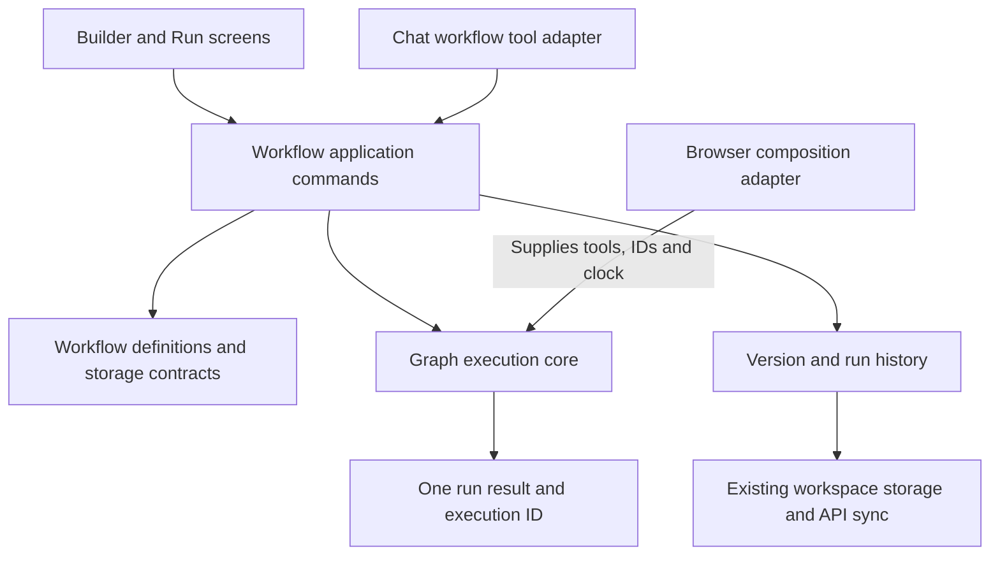

# Phase 4 — shared workflow core and application commands

The workflow engine and application rules now live in `lib/workflow-core`.
The browser builder and Chat workflow handler use that package through small adapters.
This implements the Phase 4 boundary in the [product plan](product/README.md), primarily
R-05/R-06 and the version, input and run-record portions of J2-05, J3-01/J3-03 and J4.
It does not complete every interaction in those journeys.

## Architecture in plain language

Think of the workflow system as an engine with two controls: the builder and Chat.
Both controls ask the same application layer to save a version or execute it. The
engine receives a workflow definition and a toolbox; it does not know which screen
or model requested the operation. Browser storage and server synchronization handle
persistence after the application returns a recorded result.

The application remains React/Vite, Express and PostgreSQL. This phase adds a package,
not another deployment, database or background worker. Password-free demo access and
Owner/Editor/Viewer checks from Phase 3 are retained.

## Where to make changes

| Responsibility                                                                  | Owner                                                                   |
| ------------------------------------------------------------------------------- | ----------------------------------------------------------------------- |
| Persisted definitions, execution results and backup validation                  | `lib/workflow-contracts`                                                |
| Graph order, isolated/selected/downstream execution, transfers and run assembly | `lib/workflow-core/src/core`                                            |
| Draft replacement, immutable versions, exact version queries and recorded runs  | `lib/workflow-core/src/application/commands.ts`                         |
| Template input validation, calculation and review-loop rules                    | `lib/workflow-core/src/application/templates.ts`, `template-command.ts` |
| Concrete browser tools and legacy default expansion                             | `src/shared/workflow-engine/workflow/execute.ts`                        |
| Canvas-to-definition conversion and editor projection                           | `src/shared/workflow-engine/workflow/canvas.ts` and browser UI          |
| React/Jotai state, toasts and workspace sync                                    | Browser feature adapters and existing sync service                      |

The `src/` paths refer to `artifacts/ai-workflow-builder`. Existing public paths for
`local-tool-runner`, template runtime, output presentation, edge factories and workflow
commands remain compatibility adapters. They delegate to the new owner rather than
keeping a second engine. New workflow rules belong in the package.

## Commands and guarantees

- `createWorkflow` and `replaceDraft` validate and detach input definitions. Draft
  replacement can require the expected fingerprint and rejects a stale base.
- `saveVersion` snapshots the definition. Code, formulas, source, governance, output,
  description and graph changes participate in comparison; audit timestamps and
  object-key order do not create spurious versions.
- `executeSavedWorkflow` accepts either saving/running the draft or an explicit saved
  version. Missing versions and ambiguous requests fail before invoking the executor.
  The executor receives a copy, protecting stored history from adapter mutation.
- Each new recorded execution agrees on its workflow ID and run ID. Chat saves the
  workflow identity before execution, so the result no longer points at its template.
  Query helpers return copies and never execute a workflow merely to read a result.
- An optional request ID reuses a recorded run of the same version; reusing it for a
  different version raises a conflict. This protection applies to retained library
  history. It is not a distributed lock or an exactly-once guarantee for external writes.
- Optional initiator metadata records actor/workspace IDs and the entry point. Browser
  provenance is a client claim, not a trusted audit record or authorization grant.
  The API still obtains identity and membership from its server session.
- Graph cycles, duplicate IDs and relevant missing block references fail before tools
  execute. Partial runs require an existing selected block; a missing selection never
  expands into a full run. Missing tools and failed upstream blocks cannot claim a normal successful
  calculation. Incomplete drafts can still be stored and edited.

Old backups need no migration. New run fields are optional in the generated validators.
Imported historical execution IDs remain unchanged as provenance. Existing server
revision checks, conflicts, retries and damaged-backup recovery remain in place.

## Testing and development

`pnpm run test:workflow-core` runs the portable package tests with a separate TypeScript
configuration, no frontend aliases, React or model provider. Its independent graph
fixture totals 120 and 80, then doubles the total to 400. Time, IDs and tools are supplied
by the test. `pnpm run verify` includes this suite and its typecheck alongside the
existing checks. The adapter tests exercise the actual browser executor and shared
Chat command against the same version/run contract.

For workflow changes, start there and in `test:unit`. Then run relevant browser cases.
For storage/contract changes, run integration and persistence suites; for package
boundaries, build the affected deployment. Architecture checks reject UI, agent and
connector dependencies inside the portable core. Tool implementations are supplied
through the execution port, keeping their dependencies outside it.

## Remaining boundaries

- Execution remains synchronous and browser-hosted in the active app. Runs are not
  guaranteed to continue after closing the browser; D-01 is still pending.
- D-02 and D-03 were pending when this phase completed. Phase 5 later implemented
  the confirmed retrieval policy, and Phase 6 implemented the confirmed agent
  editing policy and scoped grants.
- Concrete block executors and template catalogs still reside in browser modules,
  behind the composition adapter. Their independent migration and connector/source
  lifecycle work continue in Phases 5 and 8. Older standalone builder storage and
  Agent Lab echo tools are not replaced with a new server workflow API here.
- Per-run navigation and the final Chat/sidebar experience remain Phase 7 work.
- The optional fingerprint protects callers that supply it; the existing library
  compare-and-swap revision remains the cross-browser concurrency boundary.

No existing database was migrated, and no commit, push or deployment was performed.

## Local verification

Verified on Windows with Node 24.21.0, pnpm 10.33.2, Chromium and disposable
pgvector/PostgreSQL 16 containers. Test processes excluded ambient database,
provider and build-upload credentials.

| Check                                | Result                                                                                                                                               |
| ------------------------------------ | ---------------------------------------------------------------------------------------------------------------------------------------------------- |
| Frozen install                       | Passed; lockfile adds the workspace package only, with no external version upgrades                                                                  |
| `pnpm run verify`                    | Passed: 27 unit/adapter tests, 8 portable core tests, contract generation consistency, architecture rules, formatting and all source/test typechecks |
| `pnpm run test:integration`          | 28 passed, including migrations, workspace roles, demo isolation, backup validation and revision conflicts                                           |
| `pnpm run test:workflow-reliability` | 15 passed, including all advertised templates, the actual Chat handler, result review, uploads and shared Build/Run behavior                         |
| `pnpm run test:workflow-persistence` | 5 passed, including demo entry/exit, cross-browser recovery, retry/conflicts and account/workspace switching                                         |
| Production bundling                  | Frontend passed using the actual Vite config and an isolated output directory; isolated integration stacks also built the API                        |
| Documentation and diff               | 64 local links across 8 changed documents resolved; Phase 4 diff passed whitespace checks                                                            |

The full reliability suite preceded the final partial-selection guard. That guard
passed the final portable tests and two focused browser regressions: isolated block
execution, and shared Build/Run behavior. The focused command was
`pnpm run test:workflow-builder --grep 'isolated execution runs only|Build runs in place'`.
The final persistence suite, production build and `verify` include the guard.

The frontend build still reports existing source-map diagnostics, externalized Node
dependencies in legacy browser SDKs, and chunks above 500 kB. Those remain follow-up
work; warning limits and architecture budgets were not raised. Browser checks use the
development server. This verification does not establish live-provider behavior,
production deployment, load limits or durable background execution.

Local logs: `.cache/phase4-install.log`, `.cache/phase4-final-verify.log`,
`.cache/phase4-integration.log`, `.cache/phase4-reliability.log`,
`.cache/phase4-persistence.log`, `.cache/phase4-build.log` and
`.cache/phase4-partial-browser.log`. Browser evidence is under
`test-results/phase2/04a727d1-f9372fb2-8cb1-4334-af35-7d6a52133149` (reliability),
`04a727d1-1cbe84aa-77e8-43cb-83a9-9bc5b7a09b09` (persistence), and
`04a727d1-7e13ae18-4675-476e-9360-c9a825eb094a` (focused block/Build/Run checks).
The production output is in `04a727d1-881c5209-bb97-4fbe-a9e8-b27ae74224e4` under
the same parent. These are ignored local evidence, not committed fixtures.

The Phase 4 review patch is `.cache/phase4-review.patch`, against the pre-Phase 4
demo snapshot `93bb6c7dfd7ed33be69d88fbcbfcb8967d5755d5`. It uses an alternate Git
index to preserve the user's staging and unrelated working changes.
