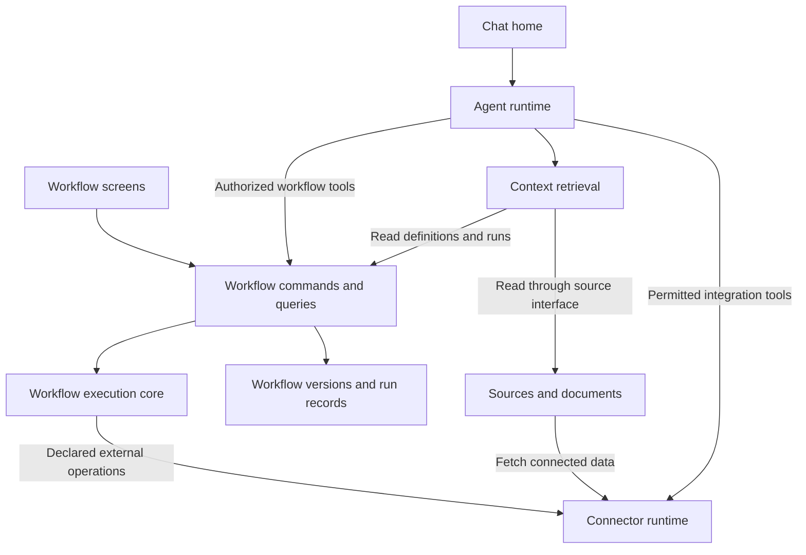

# Ownership and interfaces

This is a target separation of responsibilities, not a statement that six new
applications or deployments already exist. Start with modules in the existing
repository, browser application and Express backend.

## Target map

Arrows describe allowed capability use, not unrestricted access to another
system's database or UI state. Shared identity and authorization apply at every
owning service boundary, regardless of how the caller reached it.

## Responsibility and data ownership

| System                    | Owns                                                                                                         | Public capability                                                                 | Must not become                                                                 |
| ------------------------- | ------------------------------------------------------------------------------------------------------------ | --------------------------------------------------------------------------------- | ------------------------------------------------------------------------------- |
| Chat/workspace UI         | Conversation presentation, navigation and explicit context selection                                         | Display messages, proposals and references; open detail views                     | A second workflow engine or run database                                        |
| Agent runtime             | Model orchestration, planning, tool selection and agent activity                                             | Respond, retrieve context, request authorized operations                          | The owner of workflow mutation, validation or calculation rules                 |
| Workflow application/core | Definitions, drafts, versions, graph validation, execution orchestration, run records and relevant approvals | Read, validate, propose/apply changes, save version, request execution, read runs | A dependency on React, chat prompts or provider-specific credentials            |
| Sources/documents         | Source registrations, parsed content, revisions, processing state and provenance                             | Register, inspect, resolve data, return source/evidence references                | A store of unrelated chat or workflow editing state                             |
| Knowledge retrieval       | Indexes and retrieval logic over accessible sources and workflow read interfaces                             | Return context with origin, revision and limitations                              | An alternative authoritative copy of workflows or a source of action permission |
| Integrations/connectors   | Provider operations, connection configuration, credential references, transport policy and mappings          | Perform an authorized typed provider operation                                    | A collection of separate HTTP/auth implementations inside each UI or block      |
| Platform foundation       | Workspace identity, actor capabilities, authorization and common audit/operational plumbing                  | Authenticate, authorize, attach actor/workspace context                           | A catch-all module containing all business logic                                |

Conversation records reference workflow/run/source IDs. Search indexes are derived
data with freshness information; writes go through the owning system. A single
Postgres deployment is compatible with this ownership model. Logical separation
does not require separate databases in Phase 0.

## Workflow interface sketch — R-05, R-06, R-09

Names below are conceptual operations, not implemented endpoint names:

| Operation            | Required meaning                                                                                                    |
| -------------------- | ------------------------------------------------------------------------------------------------------------------- |
| Read workflow        | Resolve an explicit workflow ID and draft revision or saved version; respect workspace access                       |
| Validate workflow    | Return structured findings without silently repairing, approving or executing it                                    |
| Propose patch        | Identify the base revision, changed fields and reason; the proposal is not yet an applied edit                      |
| Apply patch          | Check capability and base revision, validate, then create the new draft revision; return a conflict for stale input |
| Save version         | Produce an immutable identifiable snapshot; preserve earlier versions                                               |
| Request run          | Resolve a specific version and inputs, check operation capabilities, return execution identity/state                |
| Read run             | Return the same recorded outcome, evidence, initiator and version to chat and workflow views                        |
| Request cancel/retry | Report actual capability/outcome; link retry attempts and handle already-performed external effects                 |

All effects carry caller/workspace context and an operation/request identity.
Contracts must distinguish validation failures, denied actions, conflicts, missing
objects, unavailable dependencies and execution failures. They must not represent
an unknown outcome as success. Command arguments are runtime-validated; model
output is never an exception to that rule.

The editing policy remains D-02. Explicit scoped authorization can permit routine
operations without a repeated approval dialog. Approving a proposed edit does not
also approve its calculated result or grant unrestricted future actions.

## Block and connector contracts — R-10, R-11, R-12

A block declares identity/version, configuration schema, typed input/output ports,
execution behavior, required capabilities, external effects, error behavior and
evidence output. The engine validates bindings and routes values. UI configuration
components consume that definition; they do not redefine execution semantics.

A connector operation declares its inputs/outputs, connection reference,
read/write effects, timeout and retry behavior. Credentials stay behind the trusted
connector boundary. A retryable read and a non-idempotent write require different
handling; uncertain external writes need reconciliation before blind retries.

Source references identify the input revision used. A live response may differ on
the next call; execution records retain enough permitted input/response evidence
to explain the result. Exact retention and sensitive-data handling are later
policy decisions, not a mandate to log all payloads or secrets.

If a workflow includes an AI block, it calls a narrow AI-task interface supplied
to the runner. It does not import conversation state or the agent's workflow-tool
registry. Capability restrictions and invocation limits must prevent unbounded
workflow-to-agent-to-workflow recursion.

## Independence and verification

- The core executes calculation/validation cases with injected time, IDs, inputs
  and external-operation adapters where needed; no browser or model is required.
- Agent tests can substitute the Workflow interface and inspect requested actions.
- Connector tests can use recorded/synthetic provider responses without secrets.
- Contract tests run against real adapters to catch drift hidden by test doubles.
- A provider/model/UI change should not require updating unrelated rule modules.
  A deliberate shared-interface change requires affected-consumer tests.
- Source content is untrusted data. Instructions within retrieved text do not
  change the user's authorization, agent capabilities or application policy.

These are target enforcement rules. Phase 4 onward migrates and checks them; this
pack does not claim the existing code already satisfies all of them.

## Existing implementation anchors and gaps

| Inspected implementation                                                                                          | Existing responsibility / gap relative to target                                                                            |
| ----------------------------------------------------------------------------------------------------------------- | --------------------------------------------------------------------------------------------------------------------------- |
| [App.tsx](../../artifacts/ai-workflow-builder/src/App.tsx)                                                        | Root already opens Chat; legacy/direct workflow and document routes coexist                                                 |
| [Workspace store](../../artifacts/ai-workflow-builder/src/shared/stores/workspace-store.ts)                       | Opens detail surfaces and tracks chat workspace activity; target navigation/state behavior needs dedicated acceptance tests |
| [Workflow commands](../../lib/workflow-core/src/application/commands.ts)                                           | Owns draft replacement, versions, exact queries and recorded execution; browser adapters supply concrete tools              |
| [Chat workflow command](../../lib/workflow-core/src/application/template-command.ts)                               | Validates template inputs and records execution through the same commands as Build/Run; model and Jotai state stay outside  |
| [Workflow contracts](../../lib/workflow-contracts/src/library.ts)                                                 | Deep restore validation exists; arbitrary block configuration still needs executor-specific contracts                       |
| [Sync service](../../artifacts/ai-workflow-builder/src/features/workflows-hub/services/workflow-sync-service.ts)  | Owns local/server synchronization; it is not a durable server execution scheduler                                           |
| [Agent runtime](../../lib/agent-runtime/src/agent.ts)                                                             | Shared server agent implementation; full product capability separation remains future work                                  |
| [Source connectors](../../lib/source-connectors/src/http-json.ts)                                                 | Shared HTTP parsing/mapping exists; full connection/source lifecycle is broader                                             |
| [Document API](../../artifacts/api-server/src/routes/documents.ts)                                                | Phase 3 scopes resources by authenticated workspace membership; source revision and retrieval interfaces remain future work |
| [Server application](../../artifacts/api-server/src/app.ts)                                                       | Verifies Better Auth sessions and workspace membership; operation policy is enforced before protected routes                |

See [the Phase 4 boundary](../phase-4-workflows.md) for the migrated workflow layer,
[current architecture](../ARCHITECTURE.md) for the rest of the implementation,
and [the phase handoff](README.md) for migration sequencing.
